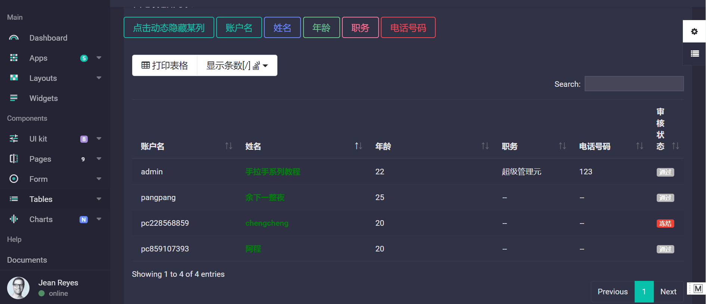

# SSM-Bootstrap4
----------------------------
#### 2018/2/10 简化代码，追求样式符合年轻人风格（bootstrap4）<br/>
            1.致谢 http://acheng1314.cn/ 作者提供入门级别学习模板
            2.致谢 https://editor.datatables.net datatable学习官方网站
          为了研究这个组件，我真的是翻了无数遍这个网站，从一个白痴级，到能高级渲染，写denpendent事件，完成我想要的效果
          逼自己一把，遇到瓶颈，请坚持下来，相信它。
            
###### 1.好的开始，从会写readme.md入手
#### 2018/2/16 数据表格展示（Bootstrap4风格）<br/>
         1. 项目开始进行 基于DataTable插件结合BootStrap4样式 数据表格显示
          （虽然有直接的Bootstrap-table组件，这个以后我肯定会入手使用这个插件，
          总结 datatable 插件的好处 ：
          样式丰富：bootstrap3 、bootstrap4  、jqueryUI 样式可以随意切换，满足你想要bootstrap-table的样式
          各种 response 、单元格处理等、自定义编辑弹窗样式
          插件丰富： css、js一大堆，只要你用对了，你想要的样式和效果都有
          专门编辑插件：结合显示插件，满足一切的数据操作
          错误提醒：数据为空会友情提示，只要控制好，就不会弹出来提示。中文网有专门常见F&Q
          不好：
          错一个都不行：js语句初始化，要严格按照手册，错一个语法，整个数据都不会加载出来，这个问题估计跟Bootstrap-table组件差不多把
          数据格式： 要有四个最基础的属性数据，详见英文网手册
          ）
         2. 首先确定使用物理分页 Mybatis+PageHelper
         3.  DataTablePageUtil 用于接收前端传过来的参数排序参数（例如每页多少记录、第几行按什么排序、第几页、
         模糊匹配的关键字等）
         4.  mybatis 配置PageHelper 这个我忘记配置，导致我总报 data数据格式不正确，因为我从后台提取的数据不能
         正确被PageInfo处理
#### 2018/2/17 简短的2月，今天github的css裸奔了，各种修改HOST，各种不成功。 最后控制台点开错误

        您被禁止访问互联网
        防火墙或防病毒软件可能已阻止您连接到网络。
        请试试以下办法：
        检查网络连接
        ///检查防火墙和防病毒配置///
        运行 Windows 网络诊断
        ERR_NETWORK_ACCESS_DENIED

直接把杀毒软件的防火墙关掉，熟悉的页面出现了。
-----
#### 2018/2/17 下一步，进行数据表格增删改查
-----


-----
  昨天在医院呆了一天，进程耽误了
 #### 2018/2/20 IDEA使用教程
            1.idea的代码补全分两类：1是单词补全，2是模板替换
            其中模板替换可自定义：setting中的live template中
            2. debug 快捷键
           
            2.1 -- 9            resume programe 恢复程序
            2.2 -- Alt+F10       show execution point 显示执行断点
            2.3 -- F8            Step Over 相当于eclipse的f6      跳到下一步
            2.4 -- F7            Step Into 相当于eclipse的f5就是  进入到代码
            2.5 -- Alt+shift+F7  Force Step Into 这个是强制进入代码
            2.6 -- Shift+F8      Step Out  相当于eclipse的f8跳到下一个断点，也相当于eclipse的f7跳出函数
            2.7 -- Atl+F9        Run To Cursor 运行到光标处
            2.8 -- ctrl+shift+F9   debug运行java类
            2.9 -- ctrl+shift+F10  正常运行java类
            2.10 -- alt+F8          debug时选中查看值debug快捷键
            
            3.搜索引擎选择： Elasticsearch与Solr  http://i.zhcy.tk/index.html
                                     
#### 2018/2/19 用户表数据显示

-----


----

           
           ====================功能列表================================ 
            1.以用户表为例子
            2.完成数据列表按列排序
            3.动态隐藏某列
            4.模糊匹配
            5.选中编辑某行记录（
            11.实现 dependent依赖事件，动态隐藏要编辑某列
            22.某列值影响其他列的值
            33.用户头像修改等功能
            ）
            6.行底统计
            ====================任务详细===============================
            1. 要想使用datatable编辑器的插件的话，首先要去官网查看例子
              确定你需要的CSS  、js ,以及顺序（以Bootstrap4为例子）
              https://editor.datatables.net/examples/styling/bootstrap4.html
              说白了，比这葫芦画瓢，画对了，基本样式就有了，如果想延伸其他功能，参照
              官网提供的其他例子，这些都是可以相互结合的。
              官网例子都是很基础简单的模板，结合起来还是需要花点时间。
            2.简简单单的一张用户表，能完成的功能也就功能列表列出的六点。
              我认为最难的是多张表数据维系，相互控制，相互关联，给人藕断丝连，
              又不能随便断章取义，搞不好，数据第一步提取就出现了冗余数据，自己还知道。
              我遇到过，小表为主表，关联一张大表，往小表做操作（做操作前，还要判断是更新
              操作，还是插入操作。同时数据显示的时候，有些行能被这个按钮弹出，
              有另外些行被另外一个按钮能控制）
            3. 数据参数命名 dao接口层 和xml映射层，要一致
            4. 数据排序，order by \` 字段名字\`  升降序
              这个字段名对应的是数据库表中字段名字，不是对应的java属性名字
              因为后台只接收传过来，第几列进行排序（0开始），所以我定义了一个String[],
              把数据表中字段名放进去，对应好。然后提取出来，拿到sql语句里进行排序
            5. 进行数据编辑的时候，前端需要知道哪个是主键,否则会报错误  idSrc: 'loginId'
            6. 编辑按钮 有两种，一种是放在数据记录中，一种是专门有几个按钮菜单栏。习惯那种可以使用那种
            7.执行数据更新操作，最关键的一步是 写SQL语句，确定准确哪些是要更新的字段，那些需要判空等前提判断
          
         执行更新操作
         更新成功后操作
  -------
  
  #### 2018/2/25 用户表数据删除（软删除）
  
            1.往往数据表中执行删除操作需要谨慎，对没有关联的表格中数据可以直接删除。无后顾之忧。
            若是关联度较大，可以增加一个字段，（1/0）来表示该记录是否删除。只要设置的好处就是，
            其他表作删除某记录时候，也可以判断该先觉字段是否已经被删除。
            举个例子 加入父亲表为商品分组表，子表为商品信息表。若要删除某商品分组，一定要判断该商品分组下有没有商品。
            
  
   #### 2018/10/04 王者归来
          1. 首先整改样式，静态页面已经设计好
          2. 设计一个系统 ，实现出来

 
#一级标题 （建议在井号后加一个空格）
## 二级标题 
### 三级标题
#### 四级标题
##### 五级标题
###### 六级标题

---
##无序列表
* 第一行
* 第二行
* 第三行 (与---分隔符 要间隔)

---
## 有序列表
1. 第一行
2. 第二行
3. 第三行 


---
## 引用文本
> 文本格式（输入你想写的文字、段落）
  如果你需要引用一小段别处的句子，那么就要用引用的格式。


---

##引用图片 （第一种格式 纯图片）


##引用图片  （第二种格式 超链接）
！[微信公众号](http://blog.didispace.com/css/images/weixin.jpg)

---

## 粗体和斜体  两个** ，在文本的两边，要匹配
**在这里粘贴您的Markdown文档，点击“预览”按钮转换为HTML格式。**

---


## Markdown基础语法

下面是Markdown的常用语法示例，可供参考

### 代码示例
1.插入普通代码 

`
System.out.println("打印一段文字");
`

2.插入JavaScript代码段
```javascript
var OnlineMarkdown = {
  init: function() {
    var self = this;
    self.load().then(function() {
      self.start()
    }).fail(function(){
      self.start();
    });
  },
  start: function() {
    this.updateOutput();
  },
  load: function() {
    return $.ajax({
      type: 'GET',
      url: params.path || './demo.md',
      dateType: 'text',
      timeout: 2000
    }).then(function(data) {
      $('#input').val(data);
    });
  },
  updateOutput: function () {
    var val = this.converter.makeHtml($('#input').val());
    $('#output .wrapper').html(val);
    PR.prettyPrint();
  }
};

OnlineMarkdown.init();
```
---

3.插入`php`代码

```php
echo 'hello,world'
```

---
### 表格示例

| 品类 | 个数 | 备注 |
|-----|-----|------|
| 苹果 | 1   | nice |
| 橘子 | 2   | job |


---
##分割线 
***

***

---

## 地址链接格式<>
<www.baidu.com>  

以上是用的比较多的，还装了几十个使用频度比较低的插件，主要包括 Snippet 和文件高亮配置，可以在这里查看：<https://gist.github.com/barretlee/a5170eb6ca1805f66687063d2e3a4983>，你也可以通过 `Settings Sync` 将这个配置下载下来，id 就是后面半截：`a5170eb6ca1805f66687063d2e3a4983`。

### 在命令行打开 VSC

在安装好 VSC 后，直接配置 `.bash_profile` 或者 `.zshrc` 文件：
插入脚本语言`bash`
```bash
alias vsc='/Applications/Visual\ Studio\ Code.app/Contents/Resources/app/bin/code';
VSC_BIN='/Applications/Visual\ Studio\ Code.app/Contents/Resources/app/bin';
PATH=$VSC_BIN:$PATH;
export PATH;
```

然后让配置生效，在控制台执行：

```bash
# 如果没有安装 zsh，可能是 ~/.bash_profile
source ~/.zshrc 
```

这个时候就可以在全局打开了：

```bash
# -a 的意思是不要新开窗口，在当前已经打开的 vsc 中打开文件
vsc path/to/file.ext -a 
```

有同学提到，VSC 的面板上搜索 `install` 就可以在命令行安装 `code` 这个命令了，不过我更喜欢使用 `vsc` 来打开文件，这也算是折腾吧 ；）
